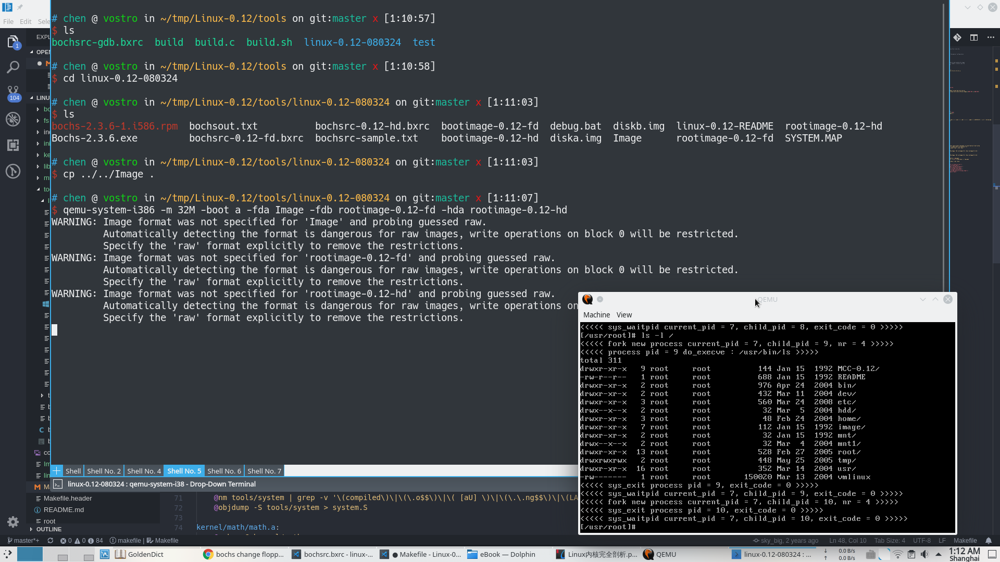
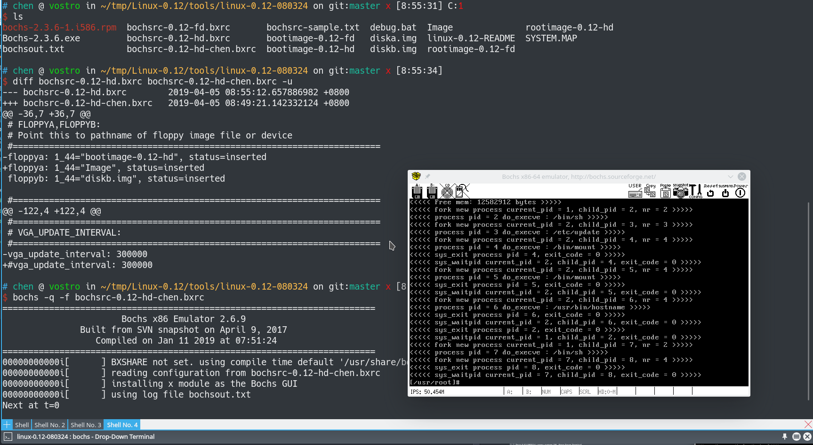

# Linux-0.12
Linux0.12内核代码中文注释 + 在高版本GCC 5.4.0 + Ubuntu 16.04

编译结果如下:

运行结果如下:

运行环境下载地址:
http://oldlinux.org/Linux.old/bochs/linux-0.12-080324.zip

用docker挂在Volume

`docker run -t -i -p 6080:6080 -v /home/chen/tmp/Linux-0.12:/home/ubuntu/Desktop/linux-0.12 -e USER=$USER  -e USERID=$UID chendotjs/ubuntu-xfce-vnc:oslab`

然后 `make CC=gcc-4.8`

编译出的Image就是系统镜像，作为floppya，用qemu和bochs都能启动

Qemu结果:

Bochs结果:

参考项目：

<https://github.com/ultraji/linux-0.12.git>